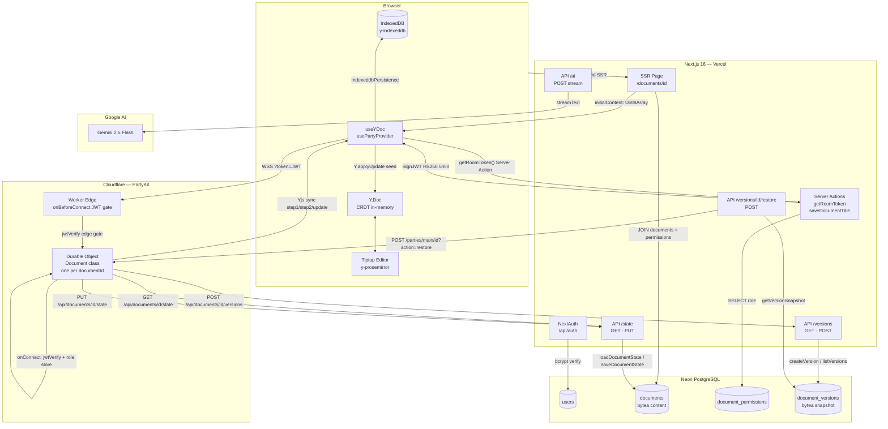
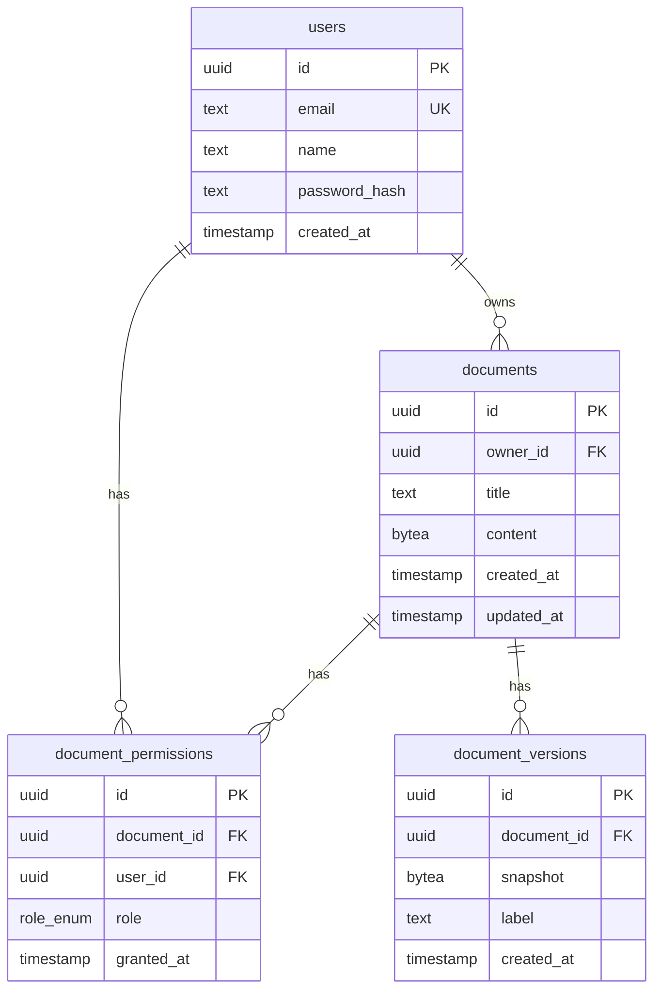
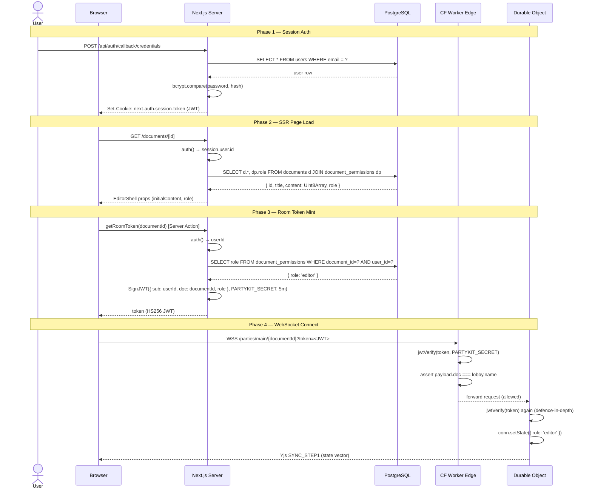
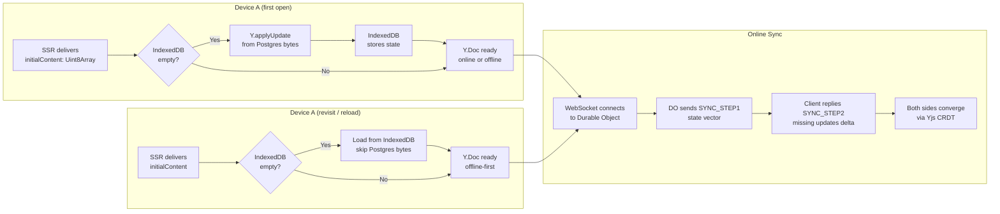
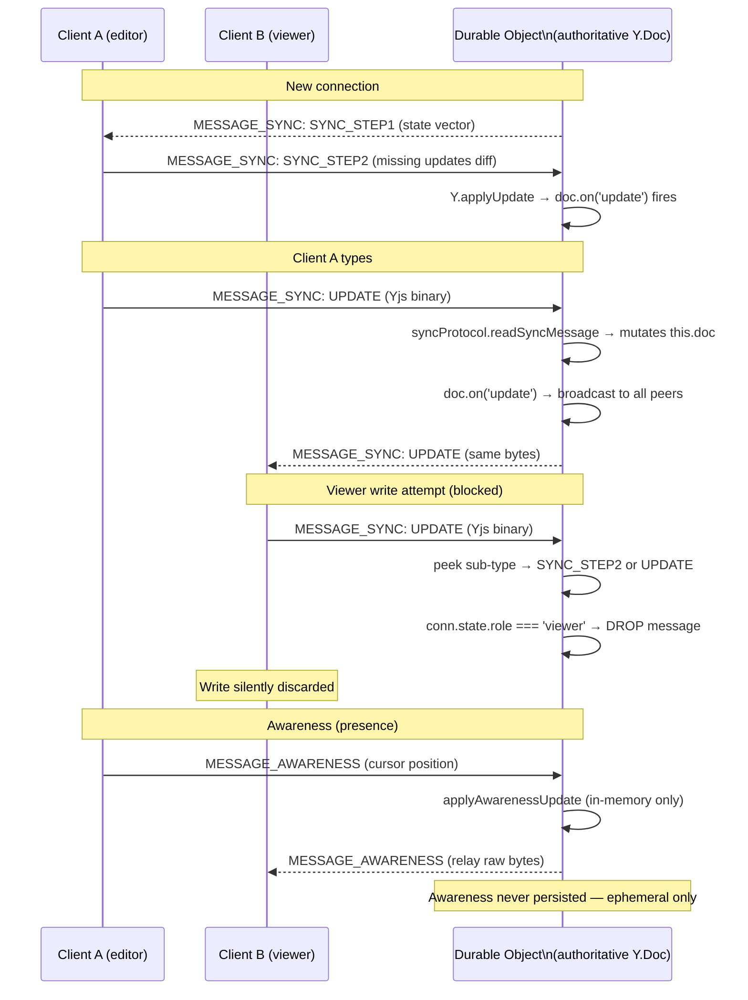
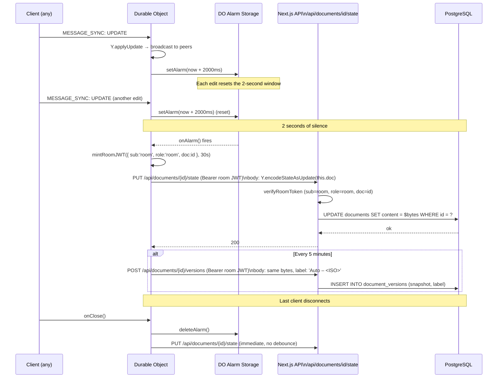
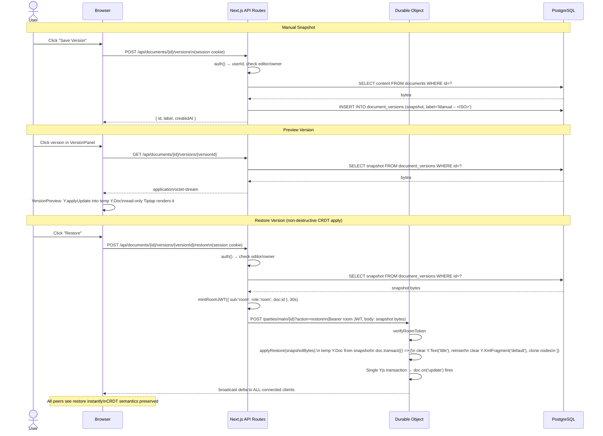
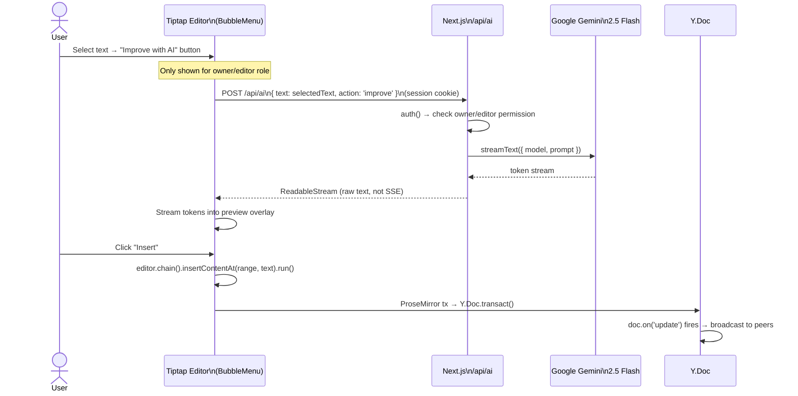

# Inkwell — Architecture Guide

Inkwell is a **local-first, collaborative document editor** with offline support, deterministic conflict resolution via CRDTs (Yjs), and full version history. This guide covers the system topology, data flows, security model, and key implementation patterns.

---

## Table of Contents

1. [Tech Stack](#tech-stack)
2. [System Topology](#system-topology)
3. [Directory Structure](#directory-structure)
4. [Database Schema](#database-schema)
5. [Authentication & Room Token Flow](#authentication--room-token-flow)
6. [Local-First Data Layer](#local-first-data-layer)
7. [Realtime Sync Architecture](#realtime-sync-architecture)
8. [Persistence & Alarm Flow](#persistence--alarm-flow)
9. [Version History & Restore](#version-history--restore)
10. [AI Integration](#ai-integration)
11. [API Routes](#api-routes)
12. [Environment Variables](#environment-variables)
13. [Security Model](#security-model)

---

## Tech Stack

| Layer | Technology | Role |
|---|---|---|
| UI Framework | Next.js 16 (App Router, React 19, TypeScript) | Pages, SSR, Server Actions, API Routes |
| Styling | Tailwind CSS + shadcn/ui | Component library |
| Rich Text Editor | Tiptap (y-prosemirror, ProseMirror) | Document editing surface |
| CRDT Engine | Yjs | Conflict-free collaborative state |
| Offline Storage | y-indexeddb | Per-device local persistence |
| Realtime Transport | PartyKit / y-partyserver (Cloudflare Durable Objects) | One room per document; WebSocket sync |
| Database | PostgreSQL (Neon) + Drizzle ORM | System of record; binary Y.Doc state |
| Authentication | Auth.js (NextAuth v5), JWT strategy | Session auth; HS256 room tokens via jose |
| AI | Vercel AI SDK + Google Gemini 2.5 Flash | Streaming text improvement |

---

## System Topology



---

## Directory Structure

```
inkwell/
├── app/                            # Next.js App Router
│   ├── (auth)/
│   │   ├── login/page.tsx          # Sign-in page
│   │   └── register/page.tsx       # Registration page
│   ├── api/
│   │   ├── ai/route.ts             # Gemini streaming endpoint
│   │   ├── auth/[...nextauth]/     # NextAuth handlers
│   │   └── documents/[id]/
│   │       ├── state/route.ts      # GET/PUT Y.Doc binary (room JWT auth)
│   │       └── versions/
│   │           ├── route.ts        # GET list / POST snapshot
│   │           └── [versionId]/
│   │               ├── route.ts    # GET snapshot bytes
│   │               └── restore/route.ts  # POST → DO restore
│   ├── documents/[id]/page.tsx     # Document editor page (SSR entry)
│   ├── layout.tsx                  # Root layout + SessionProvider
│   └── page.tsx                    # Dashboard (document list)
│
├── features/
│   ├── editor/
│   │   ├── EditorShell.tsx         # Orchestrator: composes hooks + child components
│   │   ├── Editor.tsx              # Tiptap + Collaboration extension
│   │   ├── TitleInput.tsx          # Binds to Y.Text('title')
│   │   ├── useYDoc.ts              # Y.Doc + IndexeddbPersistence
│   │   └── usePartyProvider.ts     # useYProvider wrapper + token fetch
│   └── versions/
│       ├── VersionPanel.tsx        # Sidebar: list + manual snapshot + restore
│       └── VersionPreview.tsx      # Read-only Tiptap preview from snapshot bytes
│
├── server/
│   ├── actions/
│   │   ├── auth.ts                 # register, login, signOutAction
│   │   └── documents.ts            # createDocument, getRoomToken, saveDocumentTitle
│   ├── auth/index.ts               # NextAuth config (Credentials provider + JWT callbacks)
│   └── db/
│       ├── index.ts                # postgres.js client + drizzle()
│       ├── schema.ts               # Table definitions + bytea customType
│       └── queries.ts              # All ORM-scoped queries (server-only)
│
├── party/
│   ├── worker.ts                   # Cloudflare Worker entry + onBeforeConnect edge gate
│   └── index.ts                    # Document Durable Object (Yjs sync + persistence)
│
├── lib/
│   ├── auth.d.ts                   # NextAuth module augmentation (user.id, token.id)
│   ├── schemas.ts                  # Zod validation schemas
│   ├── types.ts                    # Role type, UserSession, shared interfaces
│   └── utils.ts                    # Shared utilities
│
├── components/
│   ├── auth/                       # login-form, register-form
│   └── ui/                         # shadcn/ui primitives
│
├── middleware.ts                   # Auth guard (excludes /api/* for room callbacks)
├── next.config.ts                  # React compiler enabled
├── drizzle.config.ts               # Drizzle → ./server/db/schema.ts
├── wrangler.jsonc                  # DO binding: Main → Document class
├── tsconfig.json                   # Next.js (includes DOM lib)
└── tsconfig.worker.json            # Worker (esnext only, @cloudflare/workers-types)
```

---

## Database Schema



**Key implementation note:** `content` and `snapshot` are `bytea` columns storing raw `Y.encodeStateAsUpdate()` output. A custom Drizzle `customType` handles the `postgres.js` text-protocol format (`\x<hex>` string) in its `fromDriver` converter.

---

## Authentication & Room Token Flow



---

## Local-First Data Layer



**Priority order (implemented in `features/editor/useYDoc.ts`):**
1. `IndexeddbPersistence` restores from the browser's IndexedDB first
2. Only if IndexedDB is empty (`byteLength <= 2`), seed with `initialContent` from SSR (Postgres bytes)
3. After `synced`, the WebSocket provider reconciles any delta with the Durable Object

This means edits made offline survive page reloads (IndexedDB) and sync automatically when connectivity returns.

---

## Realtime Sync Architecture



**Viewer write-guard** is implemented in `party/index.ts` `onMessage()`: after reading the message type byte, the code saves and restores the decoder position to peek at the Yjs sub-type without consuming it. If the sender is a viewer and the sub-type is `SYNC_STEP2 (1)` or `UPDATE (2)`, the message is dropped before reaching `syncProtocol.readSyncMessage`.

---

## Persistence & Alarm Flow



---

## Version History & Restore



**Why non-destructive?** Replacing `this.doc` outright would corrupt active collaborators whose Y.Doc instances are mid-session. Instead, `applyRestore` operates within a single `doc.transact()` — producing one atomic Yjs update that peers merge cleanly.

---

## AI Integration



The AI route caps selected text at 10,000 characters. Only `owner` and `editor` roles can call it — viewers see neither the BubbleMenu button nor can they call the API (server-side check).

---

## API Routes

| Route | Method | Auth | Purpose |
|---|---|---|---|
| `/api/auth/[...nextauth]` | GET, POST | — | NextAuth session handlers |
| `/api/ai` | POST | Session (owner/editor) | Stream Gemini text improvement |
| `/api/documents/[id]/state` | GET | Room JWT | DO loads Y.Doc binary from Postgres |
| `/api/documents/[id]/state` | PUT | Room JWT | DO saves Y.Doc binary to Postgres |
| `/api/documents/[id]/versions` | GET | Session | List version metadata |
| `/api/documents/[id]/versions` | POST | Session or Room JWT | Create manual or auto snapshot |
| `/api/documents/[id]/versions/[vid]` | GET | Session | Fetch snapshot bytes for preview |
| `/api/documents/[id]/versions/[vid]/restore` | POST | Session (editor/owner) | Trigger non-destructive CRDT restore |

**Room JWT** (`{ sub: 'room', role: 'room', doc: documentId }`) is used by the Durable Object to call back into Next.js. The state/versions endpoints accept both session auth (users) and room JWTs (the DO) via `verifyRoomToken`.

---

## Environment Variables

| Variable | Used by | Purpose |
|---|---|---|
| `DATABASE_URL` | Next.js + Drizzle | Neon PostgreSQL connection string |
| `AUTH_SECRET` | Next.js | NextAuth JWT signing secret |
| `NEXTAUTH_URL` | Next.js | Auth callback base URL |
| `PARTYKIT_SECRET` | Next.js + CF Worker | HS256 HMAC secret for room JWTs (shared) |
| `NEXT_PUBLIC_PARTYKIT_HOST` | Browser + Next.js | PartyKit host (`127.0.0.1:8787` dev / CF subdomain prod) |
| `APP_URL` | CF Worker (DO) | Base URL for DO→Next.js API callbacks |
| `GOOGLE_GENERATIVE_AI_API_KEY` | Next.js | Gemini API key |

`PARTYKIT_SECRET` is the only secret shared between the Next.js runtime and the Cloudflare Worker. It is loaded via `process.env.PARTYKIT_SECRET` in Next.js and `this.room.env.PARTYKIT_SECRET` in the DO.

---

## Security Model

### Role Enforcement
Roles are resolved server-side from the database on every sensitive operation — never from client-supplied values:

```
Client sends JWT token (contains role claim)
  → getRoomToken() Server Action: ignores client claims, reads role from DB
  → Token minted with DB-sourced role
  → DO: re-reads role from the verified token (not from a client message)
  → conn.setState({ role }) — role is stored on the connection, not re-read from client
```

### Double JWT Verification
The room token is verified at **two independent points**:

1. **Worker `onBeforeConnect`** — edge gate; rejects before the Durable Object is started
2. **DO `onConnect`** — second independent verify; stores role on connection state

If either check fails the connection is rejected with HTTP 403.

### Viewer Write Gate
In `party/index.ts` `onMessage()`, for every `MESSAGE_SYNC` frame the code peeks at the Yjs sub-type byte:
- `SYNC_STEP1 (0)` — always allowed (viewers need to receive the full doc state)
- `SYNC_STEP2 (1)` or `UPDATE (2)` — dropped for `viewer` role connections

Awareness (`MESSAGE_AWARENESS`) is never gated — viewers appear in presence cursors.

### ORM-Scoped Queries
Every database query in `server/db/queries.ts` filters by the authenticated user's `documentPermissions` rows. There is no route where a user can access document data without a matching permission row:

```ts
// Example: getDocumentWithContent
db.select({ ... })
  .from(documents)
  .innerJoin(documentPermissions, eq(documentPermissions.documentId, documents.id))
  .where(and(eq(documents.id, id), eq(documentPermissions.userId, userId)))
```

### middleware.ts
Protects all non-API routes. The matcher explicitly excludes `/api/*` so the Durable Object's room JWT callbacks (`GET /api/documents/[id]/state`, `PUT ...`, `POST .../versions`) are not redirected to `/login`.

---

## Key Invariants

| # | Invariant |
|---|---|
| 1 | The in-memory `Y.Doc` is the working copy; IndexedDB is the local source of truth; Postgres is the system of record. |
| 2 | Conflict resolution is handled entirely by the Yjs CRDT. No last-write-wins, no timestamps, no hand-rolled merge logic. |
| 3 | One Durable Object per document (keyed by `documentId`). This eliminates the need for a Redis backplane. |
| 4 | Postgres is never written on every keystroke — only on a 2-second debounced DO alarm and on last-connection close. |
| 5 | Version restore never replaces the live `Y.Doc` — it applies a delta within a single `doc.transact()` to preserve CRDT integrity for all active collaborators. |
| 6 | Viewer write attempts are silently dropped at the DO message handler — viewers can observe but never mutate. |
| 7 | Room JWTs expire in 5 minutes; `usePartyProvider` calls `getRoomToken()` before every connect/reconnect. |
